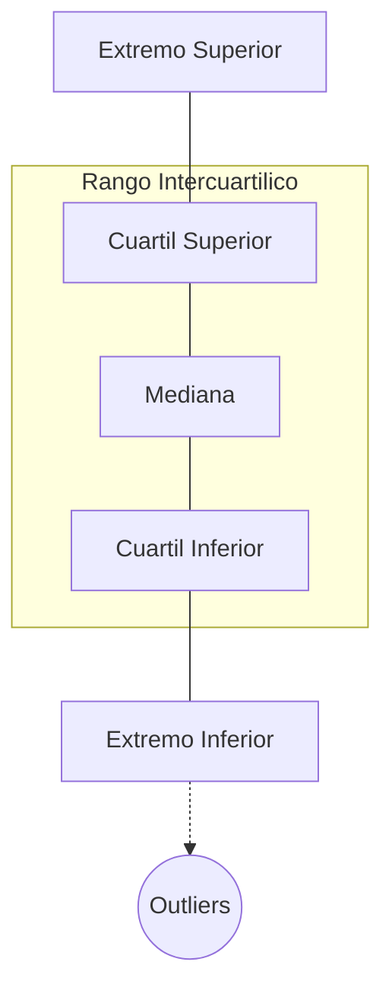
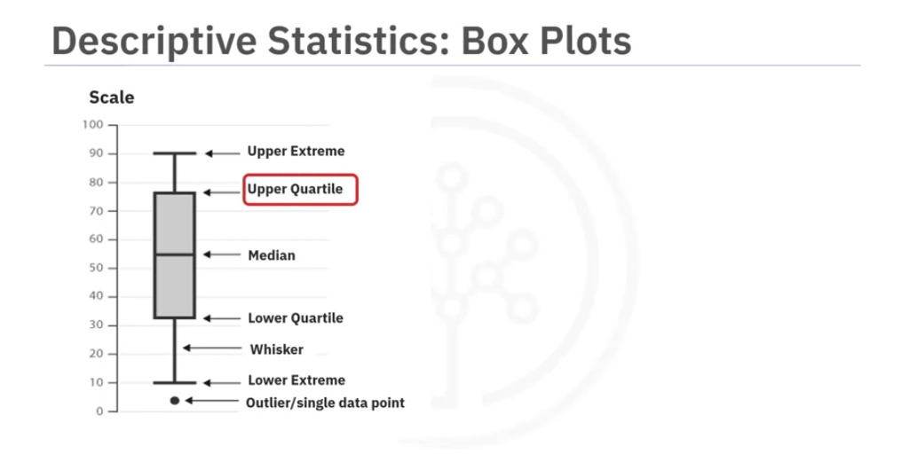
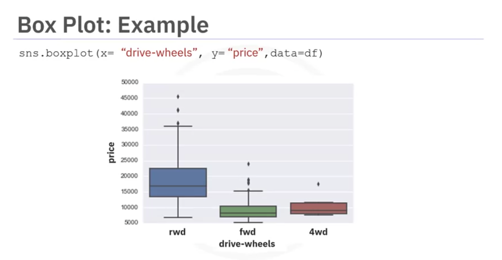
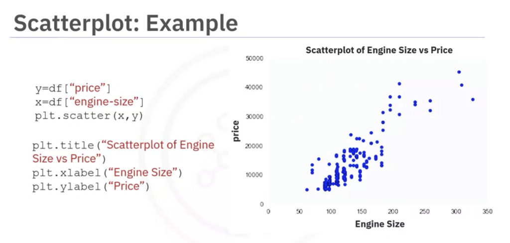

# 2. Estadísticas Descriptivas y Visualización

Antes de invertir tiempo construyendo modelos predictivos complicados, es imperativo explorar los datos. Una de las maneras más fáciles de hacerlo es calculando **estadísticas descriptivas**, las cuales nos brindan un resumen corto y claro sobre las características y medidas principales del dataset.

## Explorando Variables Numéricas: `describe()`
En Pandas, la función `describe()` calcula automáticamente las estadísticas básicas para todas las variables continuas o numéricas (saltando automáticamente los valores nulos `NaN`).

Al aplicarlo (`df.describe()`), obtendremos:
- El recuento total de datos (count).
- La media o promedio (mean).
- La desviación estándar (std).
- Los valores extremos (mínimo y máximo).
- Los cuartiles (25%, 50% -mediana-, y 75%).

## Explorando Variables Categóricas: `value_counts()`
Las variables categóricas son aquellas que se dividen en diferentes grupos o categorías discretas (generalmente texto). Por ejemplo, el tipo de tracción del auto (`drive-wheels`): tracción delantera, trasera o 4x4.

Para resumir este tipo de datos usamos el método `value_counts()`, el cual cuenta cuántas veces se repite cada categoría.
```python
# Mostrará cuántos autos hay de cada tipo de tracción
df['drive-wheels'].value_counts()
```

---

## Visualizaciones Básicas (Gráficos)

Como el texto a veces no basta para entender distribuciones complejas, nos apoyamos fuertemente en herramientas visuales.

### 1. Gráficos de Caja (Box Plots)
Los Box Plots son excelentes para visualizar la distribución de **datos numéricos** y compararlos entre distintas categorías.

**Anatomía de un Box Plot:**

- **Valores Atípicos (Outliers):** Puntos individuales que caen por fuera de los extremos. Los box plots son la mejor herramienta gráfica para identificar estos *outliers* rápidamente.



**Ejemplo en Código (usando Seaborn):**
Graficar el `price` de los autos según su categoría de tracción (`drive-wheels`). Esto permite ver a simple vista que los precios de los autos con tracción trasera (rwd) tienen una distribución mucho más alta y distinta a los de tracción delantera (fwd).



### 2. Gráficos de Dispersión (Scatter Plots)
A menudo queremos entender la relación entre **dos variables continuas** (números). Por ejemplo, ¿puede el tamaño del motor predecir el precio del auto? La mejor forma de visualizarlo es con un **Gráfico de Dispersión**.

En este gráfico, cada observación (auto) es un punto:
- **Eje X (Variable Predictora):** Es la variable independiente que usas para predecir (ej. Tamaño del motor).
- **Eje Y (Variable Objetivo/Target):** Es el resultado o lo que intentas predecir (ej. Precio).

**Ejemplo en Código (usando Matplotlib):**
Si graficamos Tamaño de motor (X) vs Precio (Y), y vemos que los puntos suben en diagonal hacia la derecha, podemos inferir a simple vista que existe una **relación lineal positiva**: a medida que aumenta el tamaño del motor, aumenta el precio.


