# 4. Creación de distintos tipos de gráficos en Python

Las visualizaciones son el núcleo del Análisis Exploratorio de Datos. Permiten descubrir patrones que serían imposibles de notar viendo solo números. Las dos bibliotecas fundamentales para esto en Python son **Matplotlib** y **Seaborn**.

## Importación de Bibliotecas
Para usar estas herramientas (especialmente en Jupyter Notebooks), la importación estándar es la siguiente:

```python
import matplotlib.pyplot as plt
import seaborn as sns

# Comando "mágico" exclusivo de Jupyter para asegurar que los gráficos 
# se muestren incrustados dentro del mismo cuaderno:
%matplotlib inline
```

---

## 1. Gráficos en Matplotlib
Matplotlib es la biblioteca base de visualización. Los gráficos más comunes que podemos generar con su módulo `pyplot` son:

### Gráfico de Líneas (`plt.plot(x, y)`)
Es el gráfico más fundamental. Une los puntos de datos ordenados con líneas. Ideal para series de tiempo.

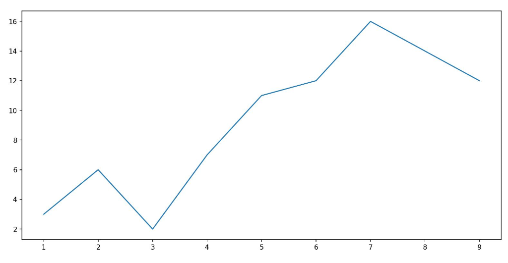

### Gráfico de Dispersión (`plt.scatter(x, y)`)
Muestra puntos individuales en un plano 2D. Excelente para ver la relación emparejada entre dos variables continuas.

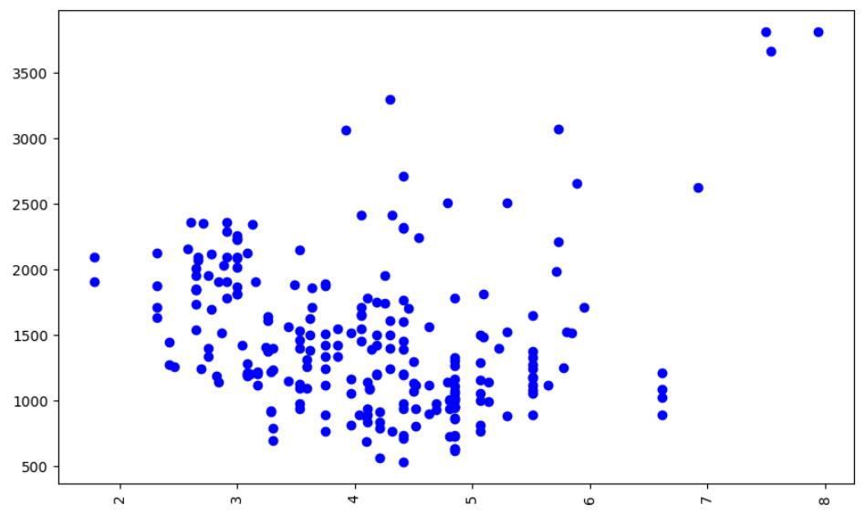

### Histograma (`plt.hist(x, bins)`)
Agrupa datos numéricos en "contenedores" (bins) para mostrar la frecuencia de los datos. *Tip: Usa `edgecolor='black'` para que las barras se distingan mejor (como se ve en el gráfico de la derecha).*

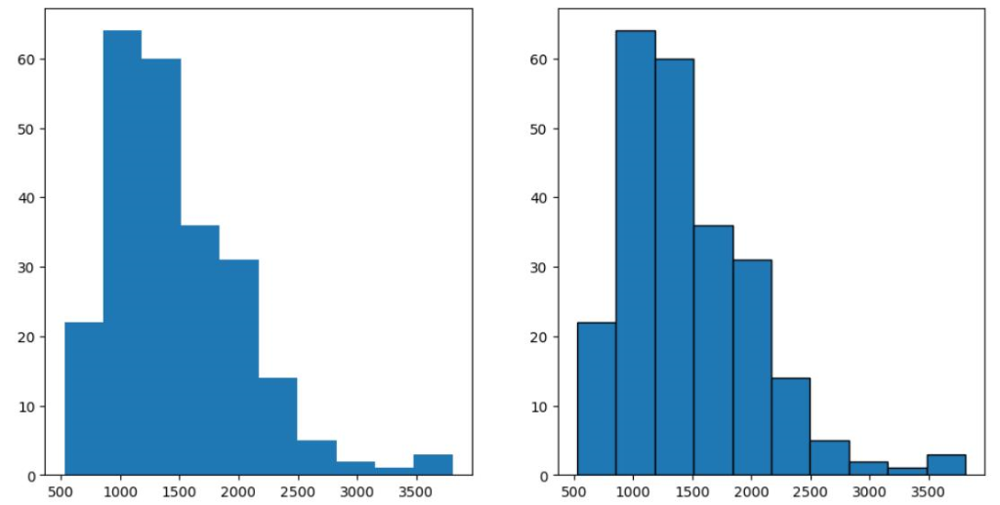

### Gráfico de Barras (`plt.bar(x, height)`)
Usado para datos categóricos (texto/categorías en el eje X, y la cantidad o altura en el eje Y).

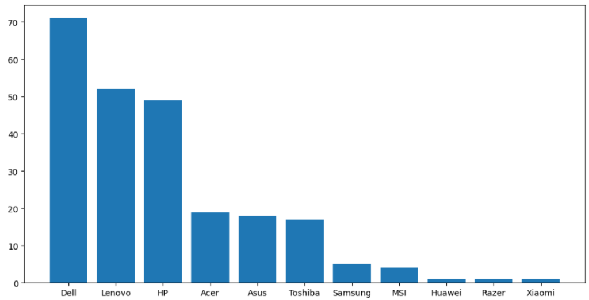

### Gráfico de Pseudocolor / Mapa de Calor (`plt.pcolor(C)`)
Crea una cuadrícula coloreada a partir de una matriz de datos. El color de cada celda depende de su valor. Se suele complementar con un mapa de colores (`cmap`). A continuación se muestran dos variaciones con distintos mapas de color.

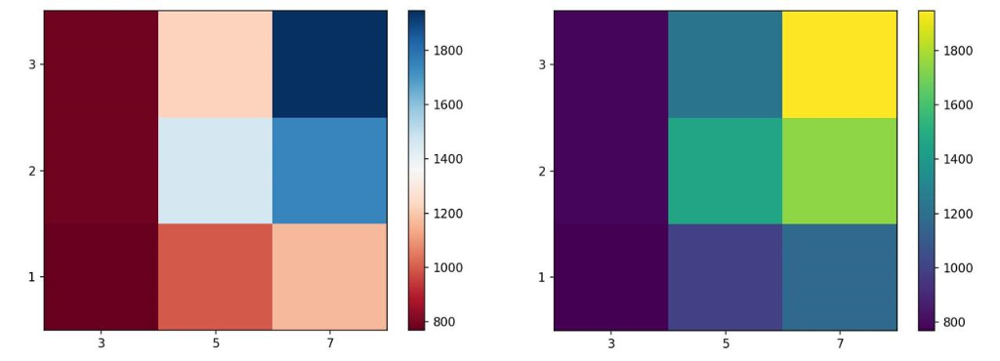

---

## 2. Gráficos en Seaborn
Seaborn está construida sobre Matplotlib, pero ofrece gráficos estadísticos más avanzados, automatizados y visualmente atractivos con menos código.

### Gráfico de Regresión (`sns.regplot(x, y, data=df)`)
Crea un gráfico de dispersión, pero automáticamente calcula y dibuja la línea de tendencia de regresión lineal, junto con su margen de confianza (sombreado).

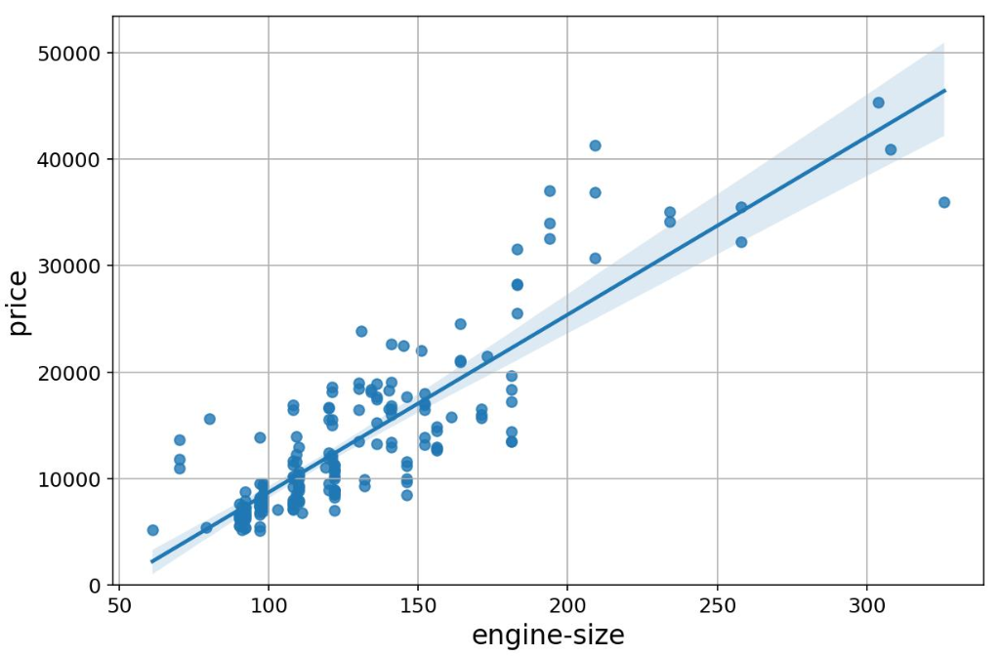

### Gráfico de Caja / Boxplot (`sns.boxplot(...)`)
Muestra los cuartiles del conjunto de datos y los valores atípicos (outliers). Ideal para comparar distribuciones entre categorías.

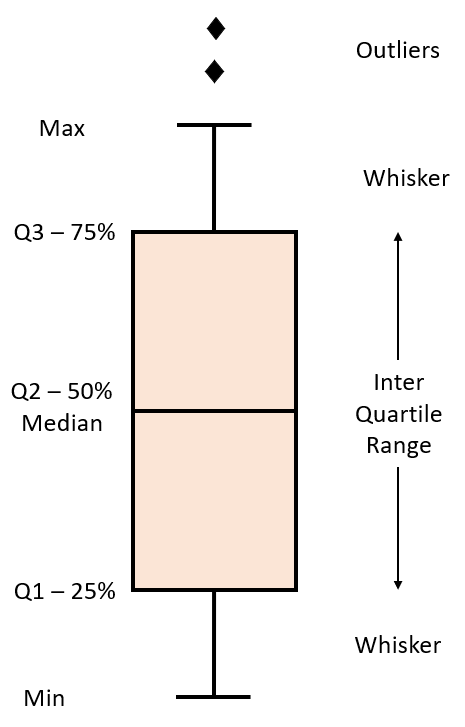
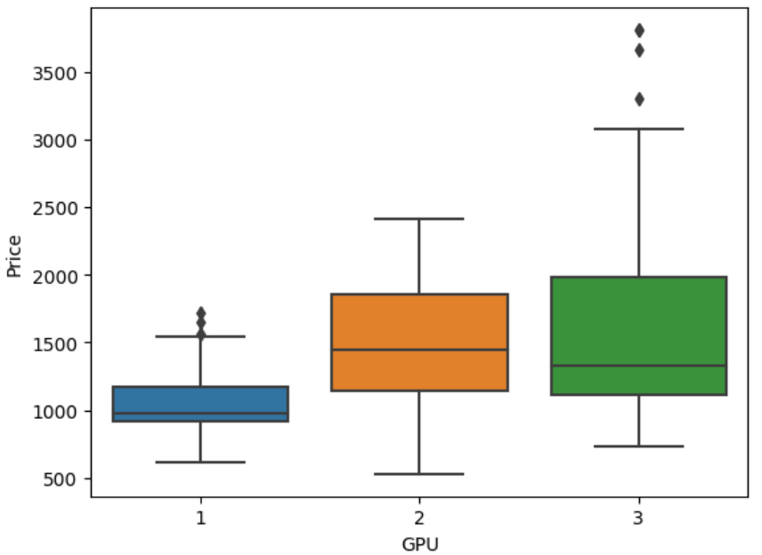

### Gráfico de Residuos (`sns.residplot(data=df, x, y)`)
Mide la calidad de tu línea de regresión. Grafica la diferencia exacta entre la predicción de tu modelo y los valores reales. Si los residuos están dispersos aleatoriamente alrededor del 0, tu modelo es bueno.

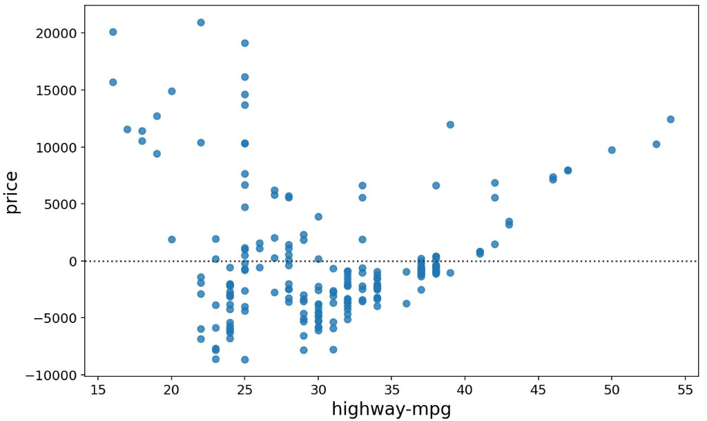

### Gráfico KDE y Distribución (`sns.kdeplot()` / `sns.distplot()`)
Dibuja una curva de distribución de probabilidad suavizada, en lugar de los bloques cuadrados de un histograma. Es la herramienta definitiva para ver distribuciones.

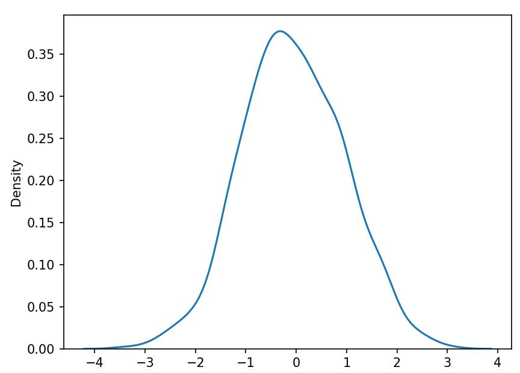
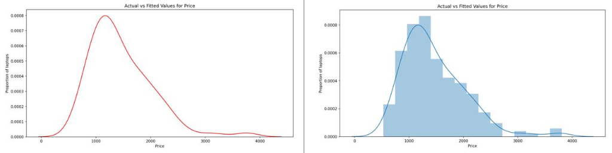

---
> **Referencias y Créditos:**
> *Estos apuntes de estudio están basados e inspirados en los conceptos del curso de Análisis de Datos de IBM, impartido por Abhishek Gagneja. Todos los derechos del material original pertenecen a IBM Corporation.*

